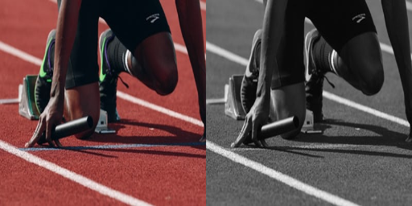

# easygans
GANs implemented using keras, under development

## Implementation

### __PIX2PIX__

A class of GANs used in image to image translation tasks like grayscale to color, edges to solids etc. In the training phase they take in both the source and target images for the generator to learn and fool the discriminator after certain number of iterations. U-Net is used as the backbone for the generator as we convoluting and deconvoluting to get the target image. 

- Input data format:



```python
from easygans.pix2pix import *

pix2pix = Pix2Pix(dataset_path='data_path', img_rows=256, img_cols=256, gf=32, df=32)
pix2pix.train(epochs=100, batch_size=100)
predictor = Predictor(model='saved_model.h5', imgpath='working/image.jpg')
predictor.predict(img_res=(256, 256))
```
- A simple application to re-color your images is deployed as [Colorify](https://huggingface.co/spaces/vishnun/Colorify) on @[Huggingface Spaces](https://huggingface.co/spaces)


## Roadmap

- [__GAN__]
- [__PIX2PIX__](https://arxiv.org/abs/1611.07004)
- [__SRGAN__](https://arxiv.org/abs/1609.04802)
- [__DCGAN__]
- [__DiscoGAN__]
- [__CycleGAN__]
- [__InfoGAN__]


## Credits

This repo is a reduced and modified version which is forked from [Keras-GAN](https://github.com/eriklindernoren/Keras-GAN) with configurable tunable parameters
